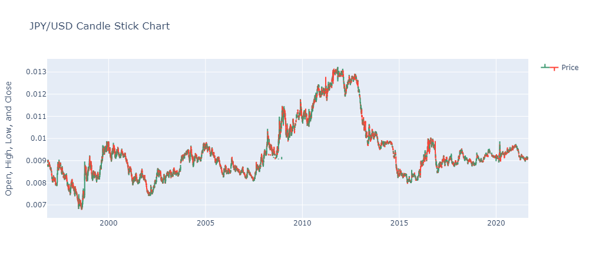

---

<h1>Currency Foreign Exchange Rates</h1>

### [Click to view Full Project](https://nbviewer.org/github/TelRich/Currency-Foreign-Exchange-Rates/blob/main/Exchange_Rates_Prediction.ipynb?flush_cache=True)
### [Click to view Data Visualization](https://nbviewer.org/github/TelRich/Currency-Foreign-Exchange-Rates/blob/main/data_viz.ipynb)
### [Click to view Project Dashboard](https://swathi0710-forexprediction-timeseries-dqrtk2.streamlit.app/)

### Summary
In this project we forecasted the closing price of currency exchange. 

There are 7 unique currency to the left of the currency pair 
>['GBP' 'EUR' 'AUD' 'JPY' 'CHF' 'USD' 'INR']

while there are 113 currencies to the right of the pair

>['EGP' 'SCR' 'NOK' 'SZL' 'MYR' 'PKR' 'NZD' 'CUP' 'CAD' 'CHF' 'ZMW' 'FJD'
 'XOF' 'IDR' 'JPY' 'UAH' 'TWD' 'MMK' 'BRL' 'CNY' 'HUF' 'MXN' 'BMD' 'KWD'
 'BBD' 'TTD' 'SEK' 'BWP' 'HNL' 'CZK' 'ISK' 'LKR' 'USD' 'RON' 'EUR' 'TND'
 'ZAR' 'SGD' 'BYN' 'PEN' 'XPF' 'THB' 'GBP' 'KRW' 'AUD' 'MOP' 'PGK' 'PHP'
 'BSD' 'CRC' 'JOD' 'MZN' 'TRY' 'BGN' 'DJF' 'COP' 'INR' 'BAM' 'PLN' 'SAR'
 'ARS' 'IRR' 'NIO' 'MWK' 'LBP' 'IQD' 'KES' 'UGX' 'KZT' 'NGN' 'GTQ' 'PYG'
 'ETB' 'SVC' 'VND' 'BND' 'MAD' 'KYD' 'ILS' 'MKD' 'HKD' 'RUB' 'AED' 'GMD'
 'BZD' 'SLL' 'MVR' 'DKK' 'MUR' 'JMD' 'OMR' 'DZD' 'BOB' 'GHS' 'RSD' 'TZS'
 'UZS' 'BDT' 'CLP' 'MGA' 'QAR' 'ANG' 'HTG' 'BHD' 'ALL' 'BIF' 'SOS' 'MDL'
 'PAB' 'XAF' 'SDG' 'DOP' 'UYU']

Due to the different currency pair, we designed a function that will take in currency A and display the possible currency B for the selected currency. Moving on, we downsample the data to weekly which resulted to  eliminating the missing entries of the daily record. 

The weekly data was plotted to check for independent features but none was found, this also means high correlation between variables and the target variable (Closing Value). KDE plot was used to check the distribution of the target variable over time and it does not appear to be normally distributed.

Stationarity test were carried out on the time series by plotting its rolling mean and standard deviation, also using Dickey Fuller Test. Non-stationary series was converted to series using log.

The data was splitted into 90/10 because of the few observations we have as a result of downsampling the data to weekly.

Two models were used in this project to forecast the closing price, ARIMA and PROPHET MODEL.

#### ARIMA MODEL
An ARIMA model is created by using pmdarima module. 
The order parameter expects a tuple of three integers representing the number of autoregressive (p), differencing (d), and moving average (q) terms to include in the model.
These parameters are extracted from the auto-arima model in the previous step by using the order() function.

#### PROPHET MODEL
The second model we are considering is the open source prophet model provided by Facebook. 
The seasonality mode parameter controls how seasonality is modeled in the time series data. We have chosen additive by assuming seasonal effects are additive to the trend component.
The parameter daily_seasonality is a boolean that is set to True to include a daily seasonality component, which means that patterns that repeat on a daily basis will be captured.
Similarly weekly_seasonality is also set to true to capture any weekly seasonaloitys that might be present.

Considering USD/INR, below is the result from ARIMA and Prophet Model
|ARIMA||PROPHET||
|---|---|---|---| 
|MSE|0.0011339080488869154|MSE| 0.0009422223295071617
|MAE| 0.029262777070431054|MAE| 0.019481331837450377
|RMSE| 0.033673551177250606|RMSE| 0.03069564023615018
|MAPE| 0.0067861488558217395|MAPE| 0.0045100611420522295

### Limitations